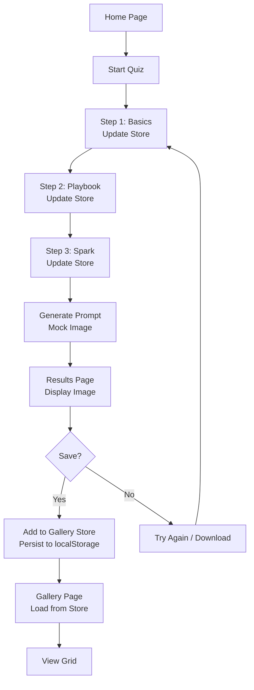

# High-Level Architecture Plan for Root Vagabond Portrait Creator

## Overview

This document outlines the high-level architecture for the Root Vagabond Portrait Creator web application, a SvelteKit-based frontend tool for Root RPG players. The app guides users through a 3-step quiz to collect character details, mocks AI image generation using a prompt template, displays the result, and allows saving to a simple gallery. The design prioritizes simplicity: no real AI integration, no backend server, minimal dependencies, and focus on core functionality without tests. The implementation will leverage SvelteKit's routing and reactivity, with state managed via stores for seamless multi-step navigation.

The app flow: Home → Quiz Steps → Results → (Optional) Gallery. All interactions are client-side, with gallery persistence via localStorage.

## Components

The UI will be broken into modular Svelte components for reusability and maintainability. Components will be placed in `src/lib/components/` unless specified otherwise.

### Core Components
- **HomePage.svelte** (`src/routes/+page.svelte`): Landing page with app intro, "Start Quiz" button linking to `/quiz/step1`.
- **Quiz Components**:
  - `QuizLayout.svelte`: Shared stepper layout with progress bar (1/3, 2/3, 3/3), navigation buttons (Back/Next), and form validation.
  - `QuizStep1.svelte` (`src/routes/quiz/step1/+page.svelte`): Multiple-choice form for Basics (species dropdown, fur color picker, eye color, build radio, height radio). Uses select/radio inputs with Root-themed options.
  - `QuizStep2.svelte` (`src/routes/quiz/step2/+page.svelte`): Visual playbook selector – grid of 9 cards (images from assets or placeholders) for playbooks (Adventurer, etc.). Click to select one.
  - `QuizStep3.svelte` (`src/routes/quiz/step3/+page.svelte`): Open-ended text inputs for defining feature, expression, treasured item, clothing (each with 100-char limit, textarea).
- **Generation and Results**:
  - `GenerationLoader.svelte` (`src/routes/quiz/generate/+page.svelte` or inline): Loading spinner with "Generating portrait..." message (mock delay 2-5s).
  - `ResultsPage.svelte` (`src/routes/results/+page.svelte`): Displays mocked image, prompt preview, buttons for "Save to Gallery", "Try Again" (redirect to /quiz/step1), "Download" (image save via browser API).
- **Gallery**:
  - `GalleryPage.svelte` (`src/routes/gallery/+page.svelte`): Grid layout of saved portraits (responsive, 3-col on desktop, 1-col mobile). Each item shows thumbnail, metadata (e.g., species), and optional delete button.
- **Shared UI**:
  - `Header.svelte`: App title, nav links (Home, Gallery).
  - `Footer.svelte`: Basic credits/info.
  - `PlaybookCard.svelte`: Reusable card for Step 2 (image, title, selected state).
  - `ImageDisplay.svelte`: Wrapper for images with alt text and loading states.

### Assets
- Static images: Playbook cards (9 PNG/SVG in `src/lib/assets/playbooks/`), placeholder portrait (generic Root-style in `src/lib/assets/placeholder.png`).
- Icons: For inputs (e.g., species icons).

## Data Flow

Quiz data flows from user inputs → state store → prompt generation → mock image → results/gallery.

1. User starts quiz: Initialize empty store.
2. Each step updates store with partial data (e.g., Step1 sets basics).
3. On "Finish": Combine data into prompt template, mock-generate image URL/base64, store result.
4. Results: Display, allow save (add to gallery store).
5. Gallery: Load from localStorage on app init, save updates back.

Mermaid flowchart for high-level flow:

This ensures reactive updates: Store changes trigger UI re-renders across steps.

## Tech Stack

- **Framework**: SvelteKit (v2+) for routing, SSR/SSG if needed (but client-side focus), file-based routes.
- **State Management**: Svelte stores (`writable` for quiz data, gallery array). Import in `src/lib/stores.js`.
  - Quiz store: Object with keys like `{ species, furColor, ..., definingFeature }`.
  - Gallery store: Array of `{ id, imageUrl, metadata, timestamp }`.
- **Styling**: Global `src/app.css` with Tailwind CSS (if added via npm) or vanilla CSS. Responsive via media queries. Root theme: Earthy colors (greens, browns), whimsical fonts.
- **Mock AI**: JS function in `src/lib/utils/mockGenerator.js`: Use prompt template to log prompt, return placeholder image (e.g., append query params to base image or simple canvas-generated base64).
- **Persistence**: browser.localStorage for gallery (JSON stringify/parse on load/save).
- **Dependencies**: Minimal – SvelteKit defaults. Optional: `npm i -D @sveltejs/adapter-auto` (already likely). No external AI libs.
- **Build/Dev**: `npm run dev` for local server (already running). Deploy via adapter-static if needed.
- **Accessibility**: ARIA labels on forms, alt text on images, keyboard nav via Svelte focus.

## Assumptions/Next Steps

### Assumptions
- Existing SvelteKit setup is functional (from `package.json`, `svelte.config.js`).
- Mock image: Use a single placeholder; no dynamic generation beyond prompt logging.
- No auth: Gallery public/local only.
- Mobile: Bootstrap responsive CSS.
- Performance: Client-side only, loads <3s via optimized assets.
- Out of scope alignment: No real AI, no editing, no sharing.

### Next Steps
1. Implement components and routes in Code mode.
2. Add stores and mock utils.
3. Style and test flow manually.
4. Delegate to Code mode for build-out, starting with quiz steps.